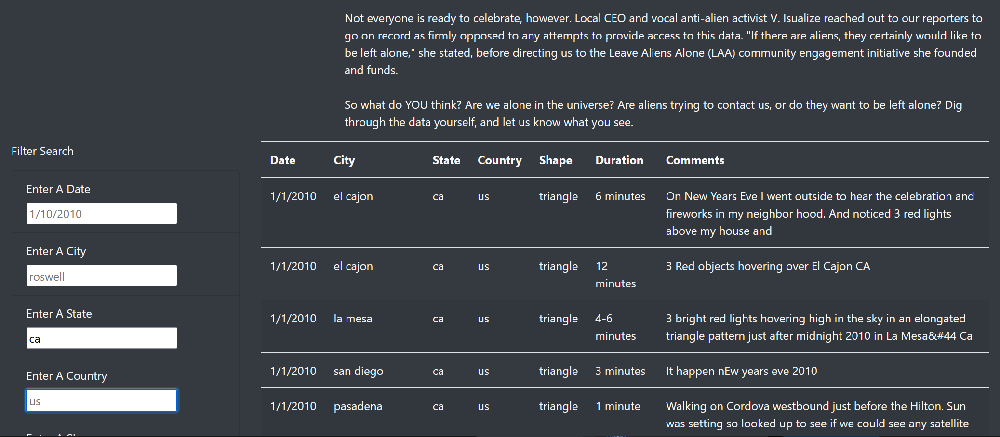
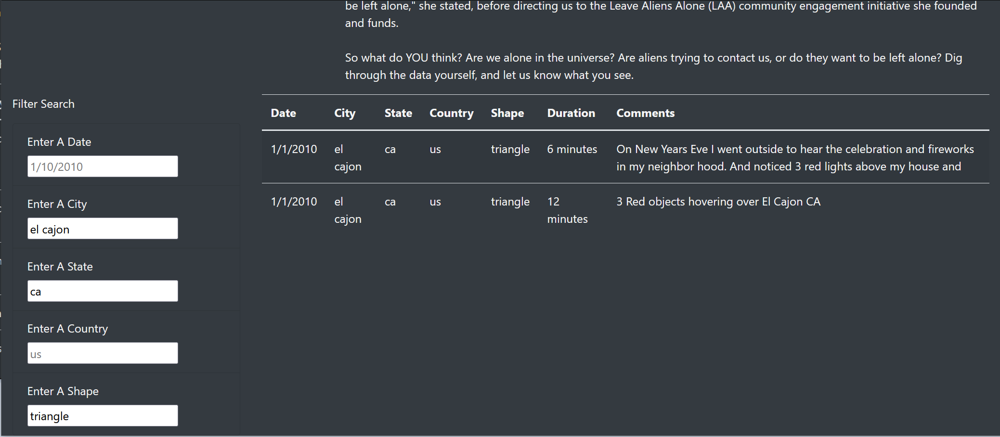

 # UFO Sightings

 ## Overview

We were asked to help Dana design a website that will help with filtering through UFO sighting data. The tools we used are JS, HTML, and CSS.

## Results

### How To Use The Filters

- Determine which of the fields you want to filter.
- Type what you want to filter for in the correct field.
- Press 'Enter' or 'Tab' in order to apply the filter.
- You can apply more than one filter.
- If we want to delete a filter, clear the field of the filter we want gone.

### Images

## Summary

### Summary of Results

One Drawback of this design is that it does not look nice. There is a big paragraph of text and it does nothing for the layout.

Two recommendations for further development are:
- Add a new "About the project" tab to contain the paragraph of text and clear up the table.
- Make the table be the primary focus of the page and reduce the size of the filters to keep the page aesthetically pleasing.
